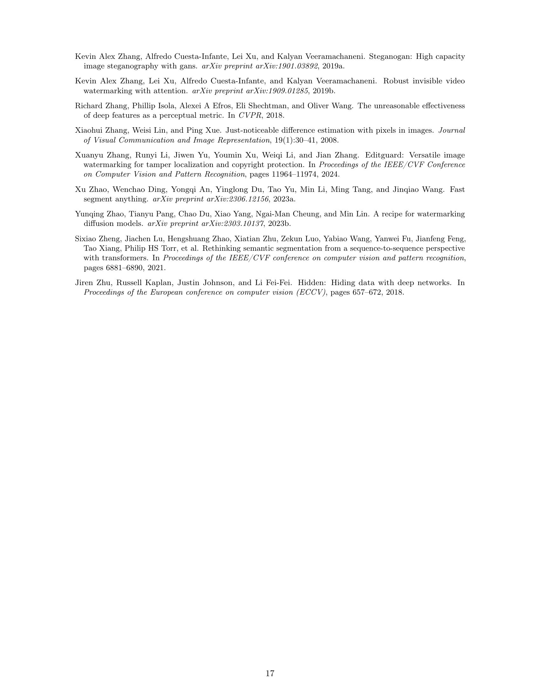

 


 2411.07231 
 Tom Sander et el. 
 



↗ arXiv


↗ Hugging Face


↗ Papers with Code


### TL;DR



Traditional watermarking techniques struggle with small watermarked areas and image manipulations like splicing.  This limits their effectiveness in real-world scenarios where images might be altered or come from different sources.  The existing methods also fail to handle multiple watermarks within the same image, which could limit their capabilities in copyright protection, the detection of AI-generated content, etc. 

The researchers introduced the Watermark Anything Model (WAM), a deep-learning approach that overcomes these limitations. **WAM imperceptibly embeds watermarks into images, then accurately segments the image to find watermarked regions, and extracts multiple messages from these localized areas.**  Experiments demonstrate that WAM excels in imperceptibility and robustness compared to existing methods, particularly against inpainting and splicing. **Its key innovation is the ability to identify and extract multiple distinct watermarks within a single image, opening up new applications.**



#### Key Takeaways


 The Watermark Anything Model (WAM) offers a new approach to image watermarking by treating it as a segmentation task. 



 WAM is robust against image manipulations like splicing and inpainting, accurately localizing and decoding multiple watermarks. 



 The two-stage training process of WAM effectively balances imperceptibility and robustness, enhancing its practical applicability. 


#### Why does it matter?
This paper is important because it introduces a novel approach to image watermarking, addressing limitations of existing methods.  It opens new avenues for research in robust watermarking techniques for AI-generated content, digital rights management, and tamper detection. The method's ability to localize and extract multiple watermarks offers significant advantages for applications requiring granular control over intellectual property protection.

------
#### Visual Insights

> 🔼 This figure provides a visual overview of the Watermark Anything Model (WAM) workflow, demonstrating its three key stages.  Panel (a) shows the embedder's role in subtly modifying the input image to imperceptibly insert a watermark containing one or more messages. Panel (b) illustrates the robustness of the method by showing how various transformations, including standard image manipulations (cropping, compression) and more advanced techniques like splicing watermarked and non-watermarked regions or inpainting, may be applied to the watermarked image. Panel (c) showcases the extraction process, where the model segments the image, isolating watermarked areas and extracting the embedded message(s) from them. This process highlights WAM's ability to localize the watermark and retrieve messages even from altered or partially obscured images.
> 

> 
read the caption

> Figure 1:  Overview. (a) The embedder creates an imperceptible image modification. (b) Traditional transformations (cropping, JPEG compression, etc.) and/or advanced manipulations (mixing watermarked and non-watermarked images, inpainting, etc.) may be applied to the image. (c) The extraction creates a segmentation map of watermarked parts and retrieves one or several messages.
> 


| Method |  | HiDDeN | DCTDWT | SSL | FNNS | TrustMark | WAM (ours) |
|---|---|---|---|---|---|---|---|---|
| COCO | PSNR (↑) | 38.2 | 37.0 | 37.8 | 37.7 | 40.3 | 38.3 |
|  | SSIM (↑) | 0.98 | 0.98 | 0.98 | 0.98 | 0.99 | 0.99 |
|  | LPIPS (↓) | 0.05 | 0.02 | 0.07 | 0.06 | 0.01 | 0.04 |
| DIV2K | PSNR (↑) | 38.4 | 38.7 | 38.2 | 39.0 | 39.1 | 38.8 |
|  | SSIM (↑) | 0.98 | 0.99 | 0.98 | 0.99 | 0.99 | 0.99 |
|  | LPIPS (↓) | 0.07 | 0.03 | 0.11 | 0.04 | 0.01 | 0.03 |

> 🔼 This table presents a quantitative evaluation of the watermark's imperceptibility.  It compares the watermarked and original images using three metrics: Peak Signal-to-Noise Ratio (PSNR), Structural Similarity Index (SSIM), and Learned Perceptual Image Patch Similarity (LPIPS).  The results are shown for images from two datasets: COCO (at lower and medium resolutions) and DIV2k (at high resolution), providing a comprehensive assessment of the watermark's impact on image quality across different resolutions and image types.
> 

> 
read the caption

> Table 1:  Evaluation of the watermark imperceptibility. We report the PSNR, SSIM, and LPIPS between watermarked and original images of COCO (low/mid-resolution) and DIV2k (high-resolution).
> 

### In-depth insights

#### Localized Watermarking
Localized watermarking presents a significant advancement in digital watermarking technology.  Traditional methods often struggle with smaller watermarked areas, leading to degraded robustness and potential ineffectiveness. **The core innovation lies in reframing watermarking as a segmentation task**, allowing for the detection and extraction of watermarks even from small, localized regions within a larger image. This is particularly useful in real-world scenarios involving image edits, splicing, or where diverse image sources are combined. **The ability to locate and extract multiple distinct messages from various areas** further enhances the practicality of the approach, surpassing the limitations of holistic methods.  **Joint training at low resolution**, prioritizing robustness before refinement for imperceptibility and multi-message handling, is an efficient and effective training strategy.  The approach demonstrates strong performance in terms of robustness, especially against image manipulations like inpainting and splicing, while maintaining competitive imperceptibility.  **The algorithm’s capability to perform localized detection and decoding** makes it suitable for applications including copyright protection, verification of AI-generated content, and tamper localization within digital images and other multimedia data.

#### Deep Learning Model
A deep learning model for watermarking, as described in this research paper, offers a novel approach to the traditional techniques.  The core innovation lies in its **segmentation-based methodology**, moving away from the holistic approach of prior methods. This allows for the **imperceptible embedding of watermarks within specific image regions**, even in areas that may have been edited or are derived from multiple sources.  The model's architecture likely comprises two main components: an **embedder** that subtly modifies the input image to incorporate the watermark, and an **extractor** capable of segmenting the image and recovering the hidden information, including multiple messages.  The success of this model hinges on its **two-stage training process**, first training for robustness at low resolution, then for imperceptibility and multi-message handling. The **post-processing using techniques like DBSCAN** allows for the identification of multiple messages even in tampered images.  This fundamentally alters watermarking, focusing on robustness and localized extraction, rather than on global watermark presence.

#### Multi-Watermark Robustness
Multi-watermark robustness examines the capacity of a watermarking system to reliably detect and extract multiple watermarks embedded within a single image, even after the image undergoes various transformations or attacks.  A robust system should **maintain high accuracy in identifying and decoding the watermarks**, regardless of whether these modifications are intentional or accidental.  This robustness is crucial for applications such as copyright protection, where multiple messages may be necessary for effective tracing and authentication.  Key considerations include **the interoperability of the different watermarks**, meaning that the presence of one should not negatively affect the detection of another, and **the design of algorithms** that can effectively segment the image and decode individual watermarks within complex, altered media. The evaluation of multi-watermark robustness requires testing the system's performance under various attack scenarios, including compression, geometric distortions, and malicious alterations, to determine its reliability and practicality in real-world conditions. **Quantifying the robustness** could involve metrics like bit error rate or precision and recall for each watermark, considering both the detection and extraction phases. A thorough analysis of this aspect is critical for developing practical and dependable multi-watermark systems.

#### Limitations of WAM
While the Watermark Anything Model (WAM) demonstrates significant advancements in localized watermarking, several limitations warrant consideration.  A key limitation is the **relatively low payload capacity**, currently restricted to 32 bits. This constraint hinders applications requiring larger embedded messages.  Furthermore, despite incorporating a Just-Noticeable-Difference (JND) map to enhance imperceptibility, the watermark can still be **visually detectable** in specific image regions, especially uniform or textured areas. This impacts the model's ability to achieve perfect invisibility. The robustness against certain types of attacks, such as high compression, could also be improved. Finally, while WAM excels at multiple watermark extraction, the **performance heavily depends on the proper selection of DBSCAN hyperparameters**, requiring careful tuning for optimal results.  Addressing these limitations, especially increasing payload capacity and further improving imperceptibility, would greatly enhance the practical applicability of WAM.

#### Future Research
Future research directions for localized watermarking should prioritize **enhancing the robustness against a wider variety of attacks**, including more sophisticated inpainting and generative AI-based manipulations.  **Increasing the payload capacity** while maintaining imperceptibility is also crucial.  Exploring new watermarking techniques, such as those leveraging advanced perceptual models or exploiting the characteristics of specific image domains, could yield significant improvements.  A focus on **developing more efficient training methods** is essential for handling high-resolution images and multiple watermarks.  Finally, a thorough investigation into the **legal and ethical implications** of localized watermarking is needed, addressing concerns about privacy, ownership, and the potential for misuse.

### More visual insights

More on figures

> 🔼 This figure illustrates the two-stage training process for the Watermark Anything Model (WAM). The first stage focuses on robustness, training an embedder to create imperceptible watermarks and an extractor to robustly detect and decode them, even after various augmentations. Augmentation involves creating a spliced image combining watermarked and original regions with a random mask, followed by additional image processing techniques.  This initial training prioritizes accurate watermark detection and decoding. A second training phase refines the model for imperceptibility and multiple watermarks. 
> 

> 
read the caption

> Figure 2:  The first training phase of WAM, as described in Sec. 4.2, jointly trains the watermark embedder to predict an additive watermark and the watermark extractor to detect watermarked pixels and decode the hidden message. In between, the augmenter 1) splices the watermarked and the original images based on a random mask and 2) applies classical image transformations.
> 

> 🔼 This figure shows a comparison between watermarking with and without using the Just-Noticeable Difference (JND) map. The left image shows the original image, the middle image displays the watermarked image without JND application, and the right image shows the watermarked image with JND attenuation. The difference between the watermarked and original images is also shown, highlighting the impact of JND on imperceptibility.  The watermark is much more visible in the image without JND processing than the image that includes JND.
> 

> 
read the caption

> (a) Without JND
> 

> 🔼 This figure shows the impact of using a Just-Noticeable-Difference (JND) map on the imperceptibility of a watermark. The left image shows a watermarked image where the watermark is highly perceptible (PSNR ≈ 24 dB). The right image shows a watermarked image after applying JND attenuation (PSNR ≈ 36 dB), making the watermark more imperceptibly hidden because the watermark's intensity is modulated according to human visual sensitivity, making it less visible in areas where the eye is not as sensitive to changes.
> 

> 
read the caption

> (b) With JND
> 

> 🔼 This figure demonstrates the effect of using a Just-Noticeable-Difference (JND) map on watermark imperceptibility. The left image shows a watermark that is highly visible after the initial training phase. By incorporating JND attenuation during the second training phase, the watermark becomes less perceptible to the human eye, particularly in areas where the visual system is less sensitive to changes. Finally, fine-tuning with the JND map restores the original robustness. The difference image (10 * abs(xm-x)) visually highlights the degree of change introduced by the watermark.
> 

> 
read the caption

> Figure 3:  Impact of the JND map on imperceptibility. (Left) After the first training phase, the watermark is highly perceptible. (Right) When applying the JND attenuation, it is hidden in areas where the eye is not sensitive to changes, which makes it less visible. Fine-tuning with the JND recovers the initial robustness. The difference is displayed as 10×abs⁢(xm−x)10abssubscript𝑥m𝑥10\times\text{abs}(x_{\text{m}}-x)10 × abs ( italic_x start_POSTSUBSCRIPT m end_POSTSUBSCRIPT - italic_x ).
> 

> 🔼 Figure 4 presents a comparative analysis of watermark localization accuracy, using the Intersection over Union (IoU) metric, and decoding accuracy (bit accuracy), measured against ground truth, on the COCO validation dataset.  The experiment involved scenarios with and without prior image cropping, as detailed in Section 5.4. The left panel displays IoU values illustrating the spatial overlap between predicted and actual watermarked regions, while the right panel shows the bit accuracy of the decoded messages, calculated using Equation 2 from the paper. This figure demonstrates the robustness of the method across different image manipulation scenarios.
> 

> 
read the caption

> Figure 4: Evaluation of the localization on the validation set of COCO, with or without cropping before extraction, following the setup described in Sec. 5.4. (Left) Localization accuracy using intersection over union between the predicted watermarked areas and the ground-truth mask. (Right) Bit accuracy between the ground truth message and the decoded message, computed from Eq. (2).
> 

> 🔼 This figure shows the results of the watermarking process after the first training phase.  The watermark is clearly visible, indicated by a PSNR (Peak Signal-to-Noise Ratio) of approximately 25 dB.  This low PSNR value reflects a significant difference between the original and watermarked images.  The image illustrates the lack of imperceptibility at this stage of training.
> 

> 
read the caption

> (a) After first training phase (PSNR ≈25absent25\approx 25≈ 25 dB)
> 

> 🔼 This figure shows the impact of the second training phase on the imperceptibility of the watermark.  The left image shows the original image, and the center image shows the result after the first training phase, where the watermark is quite visible. The right image displays the result of the second training phase, where the watermark is significantly less visible due to incorporating a Just-Noticeable Difference (JND) map. The improved imperceptibility is quantified by a peak signal-to-noise ratio (PSNR) of approximately 38 dB.
> 

> 
read the caption

> (b) After second training phase (PSNR ≈38absent38\approx 38≈ 38 dB)
> 

> 🔼 This figure shows the results of extracting multiple watermarks from a single image.  The experiment uses non-overlapping rectangular masks (10% of the image area each) to embed up to five different messages in separate parts of COCO images. The figure displays the average number of clusters identified by the DBSCAN algorithm, the overall bit accuracy of the recovered messages, and the mean Intersection over Union (mIoU) score for watermark detection. The left panel shows the results after the first training phase, demonstrating that bit accuracy decreases significantly as the number of watermarks increases. The right panel displays the results after a fine-tuning stage, illustrating that bit accuracy remains stable even when multiple watermarks are present.  The mIoU for watermark detection also remains stable across both scenarios.
> 

> 
read the caption

> Figure 5:  Results on multiple watermarks extracted from a single image. We use non overlapping 10 % rectangular masks to watermark up to 5 parts of images from COCO, with different messages, and report the average number of clusters detected by DBSCAN, bit accuracy across found messages, as well as the mIoU of watermark detection on all objects. (Left) After the first training phase, the bit accuracy strongly decreases as the number of watermarks grows. (Right) After fine-tuning, it stays roughly constant no matter the number of watermarked parts. The mIoU stays stable in both cases.
> 

> 🔼 This figure shows examples of randomly generated masks used in the training process of the Watermark Anything Model (WAM).  The masks are used to randomly occlude or reveal portions of watermarked images, thus enhancing the model's robustness against various image manipulations. Different types of masks are shown, including full-image masks covering the entire image, box-shaped masks with randomly determined sizes, and irregular, brush-stroke-like masks.
> 

> 
read the caption

> (a) Random masks
> 

> 🔼 This figure shows examples of segmentation masks used in the training process. These masks represent areas of the image that are intended to be watermarked.  Different types of masks are included, such as full masks that cover the entire image, box-shaped masks that are rectangular regions, irregular masks that are free-form shapes, and masks based on existing object segmentations from the COCO dataset. The variety in mask shapes and sizes ensures that the model learns to robustly detect and extract watermarks regardless of the watermarked area's characteristics.
> 

> 
read the caption

> (b) Segmentation masks
> 

> 🔼 Figure 6 shows examples of the masks used to train the Watermark Anything Model (WAM). The masks determine which parts of an image will be watermarked.  Panel (a) displays various random masks, including irregular shapes, rectangles, inverted versions, and completely filled or empty masks. Panel (b) shows segmentation masks generated from the COCO dataset, where the masks define areas corresponding to object boundaries.
> 

> 
read the caption

> Figure 6:  Examples of masks used during training. Only the white areas of the image end up being watermarked. (a) Random masks (irregular, rectangles, inverted, full, null or inverted). (b) Segmentation masks created from the union of COCO’s segmentation masks.
> 

> 🔼 This figure illustrates the experimental setup used to evaluate the watermark localization capabilities of the Watermark Anything Model (WAM).  The process begins with an original image. A 60% watermarked area is added to the original image. This watermarked image is then modified by cropping the upper-left 25% of the image and resizing it back to the original dimensions. The resulting image is then input to the WAM extractor to evaluate its ability to accurately locate the watermarked region, even after these transformations.
> 

> 
read the caption

> Figure 7:  Experimental protocol for the evaluation of watermark localization as performed in Sec. 5.4.
> 

> 🔼 This figure shows the results of watermark detection and decoding after the first training phase of the Watermark Anything Model (WAM).  The first training phase focuses on robustness, not imperceptibility, so the watermark is very visible. The images show the original image, the watermarked image, a mask indicating the watermarked regions, the extracted detection mask, and the decoded message.  The results demonstrate the model's ability to accurately locate and decode watermarks at this training stage, even without further augmentations. Note that this is before the model has been fine-tuned for visual invisibility.
> 

> 
read the caption

> (a) After the first phase of the training, evaluation without augmentation
> 

More on tables


| Method | FPR | TPR | Bit acc. | TPR | Bit acc. | TPR | Bit acc. | TPR | Bit acc. | TPR | Bit acc. |
|---|---|---|---|---|---|---|---|---|---|---|---| 
| HiDDeN | 0.08 | 76.9 | 95.5 | 31.2 | 80.1 | 48.4 | 87.2 | 44.7 | 88.7 | 0.9 | 68.0 |
| DWTDCT | 0.02 | 77.1 | 91.4 | 0.0 | 50.5 | 13.6 | 58.1 | 47.8 | 81.7 | 0.8 | 59.9 |
| SSL | 0.00 | 99.9 | 100.0 | 14.3 | 76.5 | 70.5 | 92.1 | 67.7 | 91.1 | 0.4 | 58.9 |
| FNNS | 0.10 | 99.6 | 99.9 | 62.4 | 86.6 | 82.1 | 93.9 | 89.4 | 97.3 | 38.7 | 88.5 |
| TrustMark | 2.88 | 99.8 | 99.9 | 36.3 | 71.4 | 90.1 | 98.2 | 39.4 | 83.2 | 83.2 | 57.1 |
| WAM (ours) | 0.04 | 100.0 | 100.0 | 99.3 | 91.8 | 100.0 | 99.9 | 97.9 | 99.2 | 100.0 | 95.3 |
> 🔼 This table presents the performance of different watermarking methods on image detection and decoding after applying various image editing techniques (geometric transformations, valuemetric adjustments, splicing, and inpainting).  It shows the bit accuracy of the decoded messages, the true positive rate (TPR) of correctly identifying watermarked images, and the false positive rate (FPR) of incorrectly classifying non-watermarked images as watermarked.  Because some methods do not have built-in detection, a modified approach is used for them: 48 bits were embedded, and 16 were used for detection.  An image was considered watermarked if fewer than 2 bits were decoded incorrectly. Results are shown separately for low/mid-resolution and high-resolution image datasets.
> 

> 
read the caption

> Table 2:  Detection and decoding after image editing (detailed in Sec. 10.4). We show the bit accuracy (Bit acc.) between the encoded and decoded messages, the proportion of images correctly deemed watermarked (TPR), and the proportion of non-watermarked images falsely detected as watermarked (FPR), in %. Since HiDDeN, DCTDWT, SSL and FNNS do not naturally provide a detection result, we hide 48 bits and reserve 16 bits for detection, and flag an image as watermarked if it has strictly less than two bits incorrectly decoded (these baselines are detailed in Sec. 5.3).
> 


| Method | FP | TPR | Bit acc. | TPR | Bit acc. | TPR | Bit acc. | TPR | Bit acc. | TPR | Bit acc. |
|---|---|---|---|---|---|---|---|---|---|---|
|  |  | 
None | Geometric | Valuemetric | Inpainting | Splicing |
|---|---|---|---|---|---|---|---|---|---|---|
| HiDDeN | 0 | 72.0 | 95.8 | 33.5 | 81.3 | 53.3 | 88.1 | 53.3 | 88.1 | 1.5 | 70.2 |
| DWTDCT | 0 | 75.0 | 88.9 | 0.0 | 50.6 | 18.4 | 58.9 | 73.0 | 86.7 | 31.5 | 71.6 |
| SSL | 0 | 100.0 | 100.0 | 32.5 | 83.6 | 75.8 | 92.8 | 95.0 | 96.1 | 0.5 | 59.8 |
| FNNS | 0 | 97.0 | 99.9 | 63.5 | 87.2 | 79.8 | 93.9 | 94.0 | 99.2 | 48.5 | 89.5 |
| TrustMark | 5 | 100.0 | 100.0 | 33.1 | 70.5 | 87.4 | 97.9 | 0.0 | 72.1 | 1.5 | 57.3 |
| WAM (ours) | 0 | 100.0 | 99.9 | 96.1 | 89.0 | 100.0 | 99.9 | 100.0 | 99.8 | 99.5 | 94.2 |
> 🔼 This table presents the results of watermark detection and decoding experiments conducted on the first 10,000 validation images of the COCO dataset, focusing on low to mid-resolution images. It compares the performance of WAM with other state-of-the-art watermarking methods (HiDDeN, DCTDWT, SSL, FNNS, TrustMark) across various image augmentations, including geometric transformations, valuemetric adjustments, inpainting, and splicing. The metrics used for comparison include the false positive rate (FPR), true positive rate (TPR), and bit accuracy.  Each augmentation type's impact on each method's performance is shown.
> 

> 
read the caption

> (a) On the first 10k validation images of COCO (low to mid resolution)
> 


Encoder|Decoder
---|---|---
$x\in\mathbb{R}^{3\times H\times W}, m\in\{0,1\}^{n_{\text{bits}}}$|$(z, z_{\text{msg}})\in\mathbb{R}^{(d_{\text{z}}+d_{\text{msg}})\times 32\times 32}$ 
Interpolation, Conv2D $\to\mathbb{R}^{d\times 256\times 256}$|Conv2D $\to\mathbb{R}^{d^{'}\times 32\times 32}$ 
$m\times\{\text{Residual Block, Down Block}\}\to\mathbb{R}^{d^{'}\times 32\times 32}$|Residual Block $\to\mathbb{R}^{d^{'}\times 32\times 32}$ 
Residual Block $\to\mathbb{R}^{d^{'}\times 32\times 32}$|Non-Local Block $\to\mathbb{R}^{d^{'}\times 32\times 32}$ 
Non-Local Block $\to\mathbb{R}^{d^{'}\times 32\times 32}$|Residual Block $\to\mathbb{R}^{d^{'}\times 32\times 32}$ 
Residual Block $\to\mathbb{R}^{d^{'}\times 32\times 32}$|$m\times\{\text{Residual Block, Up Block}\}\to\mathbb{R}^{d\times 256\times 256}$ 
GroupNorm, Swish, Conv2D $\to\mathbb{R}^{d_{\text{z}}\times 32\times 32}$|GroupNorm, Swish, Conv2D $\to\mathbb{R}^{3\times 256\times 256}$ 
$\mathcal{T}_{\theta}(m), \text{Repeat } \to\mathbb{R}^{d_{\text{msg}}\times 32\times 32}$|TanH, Interpolation $\to[-1,1]^{3\times H\times W}$
> 🔼 This table presents the detection and decoding results for high-resolution images from the DIV2k dataset.  It shows the bit accuracy (how many bits of the embedded message were correctly decoded), the true positive rate (TPR, the percentage of watermarked images correctly identified as such), and the false positive rate (FPR, the percentage of non-watermarked images incorrectly identified as watermarked).  The results are broken down by different image augmentations (transformations applied to the image such as geometric or valuemetric changes).  The augmentations include 'none' (no transformation), geometric transformations (like rotations, resizing, etc.), valuemetric transformations (brightness, contrast, filtering), inpainting (filling in missing parts of the image), and splicing (combining parts of different images).  This allows for the assessment of the model's robustness to various types of image manipulations.
> 

> 
read the caption

> (b) On the 100 validation images of DIV2k (high resolution)
> 


| Image encoder (ViT) | Pixel decoder (CNN) |
|---|---| 
| <math alttext="x\in\mathbb{R}^{3\times H\times W}" display="inline">x ∈ ℝ3 × H × W</math> | <math alttext="z\in\mathbb{R}^{d' \times 16\times 16}" display="inline">z ∈ ℝd' × 16 × 16</math> |
| Interpolation <math alttext="\to\mathbb{R}^{3\times 256\times 256}" display="inline">→ ℝ3 × 256 × 256</math> | <math display="inline">m' × \{Residual Block, Up Block\} \to \mathbb{R}^{d''\times 256\times 256}</math> |
| Patch Embed (Conv2D), Pos. Embed <math alttext="\to\mathbb{R}^{d\times 16\times 16}" display="inline">→ ℝd × 16 × 16</math> | Linear <math alttext="\to\mathbb{R}^{(1+n_{\text{bits}})\times 256\times 256}" display="inline">→ ℝ(1+nbits) × 256 × 256</math> |
| <math display="inline">m \times \{Transformer Block\} \to \mathbb{R}^{d\times 16\times 16}</math> | Sigmoid (optional) <math alttext="\to\mathbb{R}^{(1+n_{\text{bits}})\times 256\times 256}" display="inline">→ ℝ(1+nbits) × 256 × 256</math> |
| LayerNorm, GELU, Conv2D <math alttext="\to\mathbb{R}^{d'\times 16\times 16}" display="inline">→ ℝd' × 16 × 16</math> | Interpolation <math alttext="\to\mathbb{R}^{(1+n_{\text{bits}})\times H\times W}" display="inline">→ ℝ(1+nbits) × H × W</math> |
> 🔼 Table 3 details the architecture of the encoder and decoder components within the watermark embedder of the Watermark Anything Model (WAM).  It shows the layers, their types (e.g., Convolutional, Residual Block, Non-Local Block), and the dimensions of their outputs. The design is based on previous work by Ho et al. (2020), Esser et al. (2021), and Rombach et al. (2022), indicating a convolutional autoencoder structure.
> 

> 
read the caption

> Table 3: High-level architecture of the encoder and decoder of the watermark embedder embθsubscriptemb𝜃\mathrm{emb}_{\theta}roman_emb start_POSTSUBSCRIPT italic_θ end_POSTSUBSCRIPT. The design of the networks follows the architecture presented by Ho et al. (2020); Esser et al. (2021); Rombach et al. (2022).
> 


| Identity | Contrast 0.5 | Contrast 1.5 | Brightness 0.5 | Brightness 1.5 |
|---|---|---|---|---|
|  |  |  |  |  |
| Hue 0.5 | Saturation 1.5 | Median filter 7 | Gaussian blur 17 | JPEG 40 |
|---|---|---|---|---|
|  |  |  |  |  |
| Crop 0.33 | Resize 0.5 | Rotation 10 | Perspective 0.5 | Horizontal flipping |
|---|---|---|---|---|
|  |  |  |  |  |
> 🔼 Table 4 details the architecture of the watermark extractor, a key component of the Watermark Anything Model (WAM).  It outlines the structure of both the encoder (using a Vision Transformer or ViT) and the decoder (a Convolutional Neural Network or CNN). The design is inspired by previous works on semantic segmentation and image transformers, specifically referencing Zheng et al. (2021) and Kirillov et al. (2023). The table provides a layer-by-layer breakdown of the network, including input/output dimensions, activation functions, and other relevant details.
> 

> 
read the caption

> Table 4: High-level architecture of the encoder and decoder of the watermark extractor extθsubscriptext𝜃\mathrm{ext}_{\theta}roman_ext start_POSTSUBSCRIPT italic_θ end_POSTSUBSCRIPT. The design of the networks follows the architecture presented by Zheng et al. (2021); Kirillov et al. (2023).
> 


| Method | AUC: Stable Sig. | AUC: Tree-Ring | AUC: WAM | TPR@1e-2: Stable Sig. | TPR@1e-2: Tree-Ring | TPR@1e-2: WAM | TPR@1e-4: Stable Sig. | TPR@1e-4: Tree-Ring | TPR@1e-4: WAM |
|---|---|---|---|---|---|---|---|---|---| 
| None | 1.00 | 1.00 | 1.00 | 1.00 | 1.00 | 1.00 | 1.00 | 1.00 | 1.00 |
| Valuemetric | 0.94 | 1.00 | 1.00 | 0.90 | 1.00 | 1.00 | 0.90 | 1.00 | 1.00 |
| Geometric | 1.00 | 0.91 | 1.00 | 0.97 | 0.56 | 1.00 | 0.87 | 0.43 | 1.00 |
| Comb. | 1.00 | 0.75 | 1.00 | 0.99 | 0.05 | 1.00 | 0.99 | 0.01 | 1.00 |
| Splicing | 0.97 | 0.72 | 1.00 | 0.90 | 0.00 | 1.00 | 0.81 | 0.00 | 0.00 |
> 🔼 This table showcases examples of various image transformations used in Section 5 of the paper to evaluate the robustness of the watermarking model.  The transformations are categorized into valuemetric (adjusting pixel values), geometric (modifying image geometry), and others. Each column represents a different transformation type with specific parameters used during evaluation. The images visually illustrate the effects of these transformations.
> 

> 
read the caption

> Table 5: Illustration of transformations evaluated in Sec. 5.
> 


HiDDeN|DCTDWT|SSL|FNNS|TrustMark|WAM
---|---|---|---|---|---|---
TPR / Bit acc.|TPR / Bit acc.|TPR / Bit acc.|TPR / Bit acc.|TPR / Bit acc.|TPR / Bit acc.
None|76.0|95.5|77.1|91.4|99.9|100.0|99.6|99.9|99.8|99.9|100.0
Crop (20%)|66.5|93.3|0.1|50.2|3.3|68.8|98.5|99.6|2.1|50.3|99.7|88.8
Crop (50%)|71.0|94.6|0.0|50.4|7.0|73.4|99.2|99.8|1.9|60.9|99.6|95.9
Rot (10%)|7.1|80.8|0.0|50.7|11.2|78.1|76.0|94.9|3.0|56.4|97.7|77.0
Perspective (0.1)|65.7|93.6|0.0|51.8|15.6|80.0|98.0|99.6|77.8|96.7|100.0|99.8
Perspective (0.5)|32.3|89.1|0.1|50.0|0.8|61.3|51.6|91.3|2.6|50.8|100.0|96.0
Horizontal Flip|0.1|54.3|0.0|50.2|32.7|86.2|0.1|56.2|99.8|99.9|100.0|100.0
Brightness (1.5)|85.6|96.9|16.1|60.9|90.9|97.7|99.1|99.7|83.2|97.1|100.0|100.0
Brightness (2.0)|83.2|96.2|0.1|49.4|67.8|91.9|97.2|99.0|58.8|92.2|100.0|99.9
Contrast (1.5)|74.1|95.4|20.4|63.4|92.9|98.2|98.9|99.7|77.1|96.2|100.0|100.0
Contrast (2.0)|67.3|94.3|0.6|49.4|66.0|92.4|97.0|99.4|52.1|90.8|100.0|99.9
Hue (-0.1)|9.0|77.4|29.5|66.7|98.0|99.4|96.7|99.2|99.3|99.9|100.0|100.0
Hue (+0.1)|19.3|84.0|59.4|81.2|97.7|99.3|98.5|99.5|99.5|99.9|100.0|100.0
Saturation (1.5)|80.6|96.2|21.3|61.7|99.7|99.9|99.5|99.9|99.0|99.8|100.0|100.0
Saturation (2.0)|81.7|96.5|0.3|47.4|98.3|99.5|99.4|99.8|96.8|99.5|100.0|100.0
Median filter (3)|74.6|94.9|0.9|53.2|82.8|96.5|99.4|99.9|99.7|99.9|100.0|100.0
Median filter (7)|23.4|83.0|0.4|53.0|20.4|80.7|61.1|90.2|99.4|99.9|100.0|100.0
Gaussian Blur (3)|47.1|88.0|41.7|77.0|97.2|99.1|87.3|95.5|99.8|99.9|100.0|100.0
Gaussian Blur (17)|0.1|51.2|0.0|49.8|3.8|69.6|0.0|50.5|98.7|99.8|100.0|99.8
JPEG (50)|11.2|77.3|0.0|49.8|5.1|72.5|34.5|86.9|99.1|99.8|99.9|99.0
JPEG (80)|32.8|86.8|0.1|50.5|66.1|92.6|80.5|95.4|99.6|99.9|100.0|99.9
Proportion (10%)|0.8|65.9|1.1|56.9|0.6|61.8|36.3|88.2|2.0|58.6|99.9|94.2
Collage (10%)|0.9|70.1|0.5|62.8|0.1|55.9|41.1|88.7|1.3|55.7|100.0|96.5
Combination|44.7|88.7|0.0|49.9|1.2|62.8|87.7|96.1|1.7|58.8|99.2|87.2
> 🔼 Table 6 presents a comparison of watermark detection performance between WAM and other generation-time watermarking methods.  The methods were tested on 1000 non-watermarked and 1000 watermarked images (which may have been altered).  The table shows the Area Under the Curve (AUC) of the ROC curve, True Positive Rate (TPR) when the False Positive Rate (FPR) is 10⁻², and TPR when the FPR is 10⁻⁴.  Note that Stable Signature uses bit accuracy as its score, whereas Tree-Ring and WAM use a detection score.  Overall, WAM shows competitive performance compared to existing methods, although the generation-time methods offer some advantages.
> 

> 
read the caption

> Table 6:  Detection results for WAM and generation-time watermarking methods, on 1k negative (non-watermarked), and 1k positive (watermarked), possibly edited, images. AUC refers to the Area Under the ROC curve, TPR@10−2superscript10210^{-2}10 start_POSTSUPERSCRIPT - 2 end_POSTSUPERSCRIPT is the TPR at FPR=10−2absentsuperscript102=10^{-2}= 10 start_POSTSUPERSCRIPT - 2 end_POSTSUPERSCRIPT. Stable Signature (Fernandez et al., 2023a) embeds a 48-bit message and uses the bit accuracy as score, while Tree-Ring (Wen et al., 2023) and WAM output a detection score. WAM is competitive with watermarking methods for generative models (although the latter offer noteworthy advantages).
> 


| Original | Watermarked | Difference | Original | Watermarked | Difference |
|---|---|---|---|---|---|---|
|  |  |  |  |  |  |
|  |  |  |  |  |  |
|  |  |  |  |  |  |
|  |  |  |  |  |  |
|  |  |  |  |  |  |
> 🔼 Table 7 presents a detailed breakdown of the watermarking model's performance on the COCO validation dataset, focusing on detection and decoding accuracy.  It expands upon the aggregated results shown in Table 2(a) of Section 5.3, providing more granular insights into the model's robustness against various image manipulations. Each row represents a different type of image transformation (e.g., cropping, brightness adjustment, JPEG compression, etc.), and the columns show the True Positive Rate (TPR), False Positive Rate (FPR), and bit accuracy.  A combination of multiple transformations is also tested.  The TPR is calculated using a threshold on the detection score that maintains an FPR of 0.04%. Bit accuracy reflects the percentage of correctly decoded bits in the embedded message.
> 

> 
read the caption

> Table 7:  Full decoding results on the COCO validation set, used for the aggregated results presented in Tab. 2(a) of Sec 5.3. “Combination” corresponds to JPEG-80, Brightness 1.5 and Crop 50% all on the same image, and was not part of the evaluation of Sec. 5.3. TPR is for a threshold on the detection score sdetsubscript𝑠dets_{\text{det}}italic_s start_POSTSUBSCRIPT det end_POSTSUBSCRIPT such that FPR =0.04%absentpercent0.04=0.04\%= 0.04 %. The bit accuracy is computed as described in Eq. 2.
> 

### Full paper



